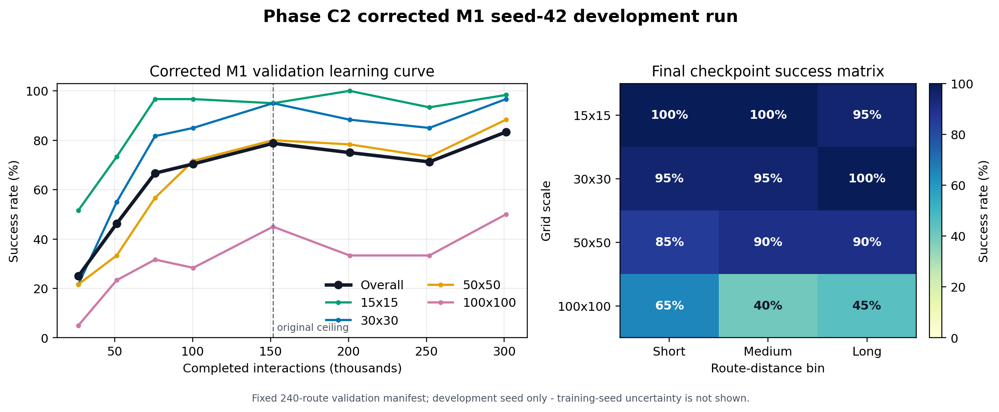

# Corrected Phase C2 M1 Development Result

**Evidence cutoff:** 2026-08-08

**Classification:** development validation, single training seed

**Training source:** commit `6b1ccda125aaa7973dac3196e45643379180b926`
(`rl-v3-c2-kaggle-v11`)

**Model / seed / device:** M1 / 42 / CPU

## Scientific Status

This is the first preserved M1 run trained and evaluated after repairing the
native multiscale environment and the v11 measurement pipeline. It establishes
that M1 can learn empty-map multiscale routing. It is not confirmatory evidence
and must not be reported as a multi-seed or final-test result.

The fixed 240-route validation manifest was inspected at every checkpoint.
Validation applied legal-action masks, used native `crashed` as the collision
field, and recorded zero invalid selected actions. The final checkpoint reached
200/240 successes (83.33%; route-level Wilson 95% interval 78.10%-87.52%) and
zero collisions.

Route-level intervals measure uncertainty over this fixed route sample. They do
not capture variability from neural-network initialization, action sampling,
or training trajectories. Confirmatory multi-seed training remains required.

## Learning Curve

| Requested interactions | Completed update-aligned interactions | Overall | 15x15 | 30x30 | 50x50 | 100x100 |
|---:|---:|---:|---:|---:|---:|---:|
| 25,000 | 26,624 | 25.0% | 51.7% | 21.7% | 21.7% | 5.0% |
| 50,000 | 51,200 | 46.3% | 73.3% | 55.0% | 33.3% | 23.3% |
| 75,000 | 75,776 | 66.7% | 96.7% | 81.7% | 56.7% | 31.7% |
| 100,000 | 100,352 | 70.4% | 96.7% | 85.0% | 71.7% | 28.3% |
| 150,000 | 151,552 | 78.8% | 95.0% | 95.0% | 80.0% | 45.0% |
| 200,000 | 200,704 | 75.0% | 100.0% | 88.3% | 78.3% | 33.3% |
| 250,000 | 251,904 | 71.3% | 93.3% | 85.0% | 73.3% | 33.3% |
| 300,000 | 301,056 | **83.3%** | **98.3%** | **96.7%** | **88.3%** | **50.0%** |



The run was extended beyond its original 150k ceiling because the curve was
still improving under the frozen method. The 150k-to-300k sequence
(78.8%, 75.0%, 71.3%, 83.3%) is non-monotonic. This is evidence of policy drift
or PPO training instability, not smooth convergence. The final checkpoint is
also the best observed checkpoint on the development manifest, but that choice
must be treated as validation-guided model selection.

## Final Checkpoint Diagnosis

At 301,056 completed interactions:

- scale success was 98.3%, 96.7%, 88.3%, and 50.0% for 15, 30, 50, and 100;
- distance-bin success was 86.3%, 81.3%, and 82.5% for short, medium, and long;
- 40 failures comprised 24 two-cell oscillations, 12 longer repeated loops,
  and 4 other step-limit timeouts;
- there were no native collisions and no invalid selected actions;
- successful routes had mean path-cost gap 7.505 and mean path-cost ratio
  1.263 relative to the empty-grid octile optimum; and
- measured CPU latency averaged 2.933 ms for policy inference and 3.082 ms for
  masked action selection in this local validation process.

The scale-distance matrix shows that route length is not the dominant final
failure axis. The 100x100 row remains weak across all three distance bins
(65%, 40%, and 45%), while every 15x15, 30x30, and 50x50 cell is at least 85%.
The main unresolved C2 problem is therefore scale handling at 100x100, with
oscillatory behavior as the most common terminal failure.

## Artifact Integrity

The durable run directory at the evidence cutoff was:

`D:\UAV Dynamic Routing\phase-c2-v11-M1-seed42\artifacts`

The latest recovery bundle contains all eight models, evaluations,
curriculum-generator states, and RNG states, plus status, provenance, and its
inventory. All 34 inventoried payloads were independently rehashed with zero
missing, extra, or mismatched entries, and the embedded inventory matched the
external inventory byte-for-byte.

Principal SHA-256 values:

| Artifact | SHA-256 |
|---|---|
| `evaluation_301056.json` | `e01efb6bb779880e6aa254cbf33c3c7224bd085c1eb415ac1947f7563b06a6d7` |
| `model_301056.zip` | `0068ec527eb63c2d51128659a739bb3f3484b90c6837b0ab16febd95c88f82d9` |
| `latest_checkpoint_bundle.zip` | `a2f5243460235ecfb1b9b60853dba7915ff707b6a724e09c4102878a72c6699d` |
| `provenance.json` | `eb0438b77937bbe43fa009e3b95386097cb890087a5793a4bd92a36619b175a4` |
| `status.json` | `493d0b1dc1442883e485590d90fb619ddd634a7b2157dee403f7342a1d97714f` |

The run provenance identifies the exact Git commit. Some recorded source hashes
were calculated from the Windows CRLF working tree, whereas the release
notebook's gate hashes canonical Git LF bytes. This does not invalidate this
local run's source identity, but it is a cross-platform resume-contract defect
that must be repaired before the confirmatory experiment.

The original 150k raw and complete archives predate the 200k-300k extension.
The 301,056 checkpoint bundle is the authoritative extended recovery artifact;
a non-nesting final evidence archive is still required.

## Decision

Do not tune M1 further from this one seed. First harden canonical source hashes,
arbitrary update-aligned resume validation, and non-nesting archives. Then run
the predeclared M2 scalar-only control on the same training/validation schedule.
Empty maps contain no obstacle geometry, so M2 is a high-value diagnostic: it
tests whether the 428,937-parameter spatial model contributes useful scale
handling or whether the four scalar navigation features are sufficient.

After comparing M1 and M2, freeze the C2 method and checkpoint-selection rule,
then run confirmatory training seeds. The final test set remains sealed. C3
must separately revisit collision semantics and reward design; the empty-map
R2-PB result is not approval for obstacle-rich training.

## Regeneration

The machine-readable summary and figure are regenerated directly from raw
checkpoint evaluations with:

```powershell
python scripts\summarize_phase_c2.py `
  'D:\UAV Dynamic Routing\phase-c2-v11-M1-seed42\artifacts' `
  'evaluation\results'
```

The generated summary is
`evaluation/results/phase_c2_v11_m1_seed42_summary.json`.
