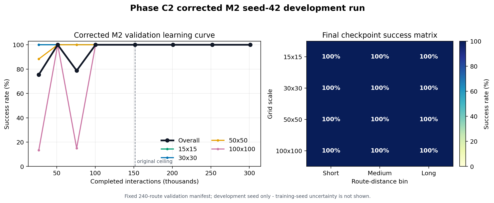
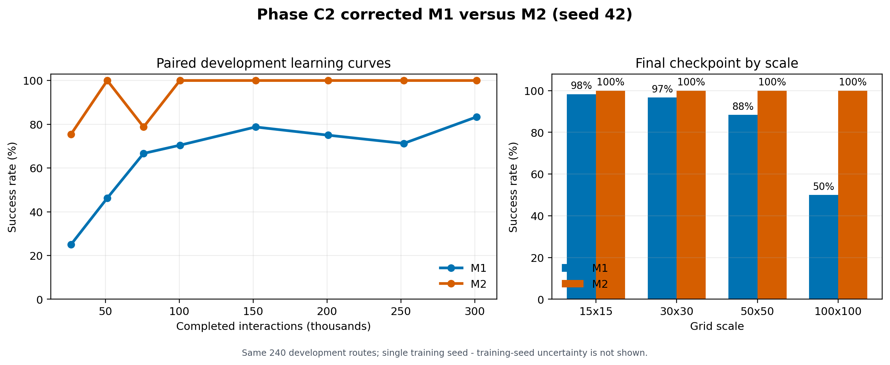

# Corrected Phase C2 M2 Development Result and Model Decision

**Evidence cutoff:** 2026-08-08

**Classification:** paired development validation, one training seed per model

**M2 source:** commit `eda350fe2b5b5944ca1bfe0f3ce3656448f77a70`
(`rl-v3-c2-kaggle-v12`)

## Result

The frozen scalar-only M2 control completed 301,056 update-aligned interactions
from seed 42. Its final checkpoint solved all 240 fixed development routes,
including all 60 routes at 100x100, with zero collisions and zero invalid
selected actions. The route-level Wilson 95% interval is 98.42%-100%.

This demonstrates that empty-map multiscale Phase C2 does not require the
global/local map encoder. It does not yet establish training-seed robustness or
final-test performance.

| Requested interactions | Completed interactions | Overall | 15x15 | 30x30 | 50x50 | 100x100 |
|---:|---:|---:|---:|---:|---:|---:|
| 25,000 | 26,624 | 75.4% | 100% | 100% | 88.3% | 13.3% |
| 50,000 | 51,200 | 100% | 100% | 100% | 100% | 100% |
| 75,000 | 75,776 | 78.8% | 100% | 100% | 100% | 15.0% |
| 100,000 | 100,352 | 100% | 100% | 100% | 100% | 100% |
| 150,000 | 151,552 | 100% | 100% | 100% | 100% | 100% |
| 200,000 | 200,704 | 100% | 100% | 100% | 100% | 100% |
| 250,000 | 251,904 | 100% | 100% | 100% | 100% | 100% |
| 300,000 | 301,056 | 100% | 100% | 100% | 100% | 100% |

The 50k perfect checkpoint was followed by a sharp 100x100 regression at 75k.
After explicit all-scale curriculum training began, validation returned to 100%
at 100k and remained perfect through five consecutive reporting checkpoints.
The representation is therefore sufficient, but PPO policy drift remains a
real phenomenon that the paper must report.

## Paired M1-M2 Development Comparison

Both final models were evaluated in identical route order. At 301,056
interactions, M2 succeeded on all 40 routes that M1 failed, while M1 succeeded
on no route that M2 failed. The exact paired McNemar p-value over these routes
is `1.819e-12`. This route-level test does not account for training-seed
variation and cannot by itself establish model-level superiority.

| Final-checkpoint property | M1 | M2 |
|---|---:|---:|
| Overall success | 83.3% | **100%** |
| 100x100 success | 50.0% | **100%** |
| Trainable parameters | 428,937 | **9,545** |
| Model file size | 5,388,317 bytes | **144,242 bytes** |
| Mean successful path-cost ratio | 1.263 | **1.135** |
| Mean CPU policy inference latency | 2.933 ms | **1.036 ms** |
| Collisions / invalid actions | 0 / 0 | 0 / 0 |

M2 uses 44.94 times fewer trainable parameters, its saved model is 37.36 times
smaller, and measured CPU policy inference was 2.83 times faster. Its mean
successful-route path ratio was 10.13% lower relative to M1. Timing values are
local process measurements rather than hardware-independent benchmarks.

The defensible C2 interpretation is not that convolutional spatial perception
is generally harmful. It is that spatial perception is unnecessary in an empty
grid and made this particular learning problem harder. M1 remains relevant for
C3-C5, where obstacles and dynamic occupancy create spatial information that
M2 cannot observe.

## Artifact Integrity

The authoritative M2 artifact directory is:

`D:\UAV Dynamic Routing\phase-c2-v12-M2-seed42\artifacts`

The latest recovery bundle contains 34 inventoried payloads with zero missing,
extra, or mismatched entries. The raw and complete final archives each contain
36 direct-evidence entries and no nested recovery, raw, or complete container
archives.

| Artifact | SHA-256 |
|---|---|
| `evaluation_301056.json` | `fe6710c9b86b2f11b4f3e11c477f09e611a71cebabcec966e3557d5f3bed777a` |
| `model_301056.zip` | `6a07ffba99599a572139c5735852022fe5fbbf442ced443f89345c698364a17f` |
| `latest_checkpoint_bundle.zip` | `0cdd67258f2fe3de2a065dabe422019e3835305e9a823f389613ac32f1dd960b` |
| `rl_v3_phase_c2_M2_raw_artifacts.zip` | `d21651515a29673f64ed09e4c4a0655fe96d774f6d34f1987d970e6f051e6f40` |
| `phase_c2_M2_COMPLETE.zip` | `d21651515a29673f64ed09e4c4a0655fe96d774f6d34f1987d970e6f051e6f40` |
| `provenance.json` | `c9dfa7b1d60cbf9c26a24a42a253324fb2d877e0675d3aec99da695c9b841118` |
| `status.json` | `69ec9f83d77d44afee711fa81bfd77913787a02d9235a4760bfe4492dfd12547` |

## Frozen Confirmatory Decision

M2 is selected for confirmatory C2 evaluation. The fixed training target is
150,000 requested interactions (151,552 completed), not per-seed best-checkpoint
selection. This target follows explicit exposure to all four curriculum scales,
matches the original C2 budget, and avoids spending an additional 150k
interactions after the seed-42 curve had stabilized.

The development seed 42 is excluded from confirmation. The confirmatory seeds
are predeclared as 11, 22, 33, 44, and 55. Each seed will be trained from
interaction zero with identical code, configuration, curriculum, and validation
manifest. The primary reported checkpoint is 151,552 for every seed, including
poor seeds. Intermediate checkpoints remain diagnostic only. The final test set
stays sealed until this protocol and the downstream model decision are frozen.

## Machine-Readable Evidence

- `evaluation/results/phase_c2_v12_m2_seed42_summary.json`
- `evaluation/results/phase_c2_v12_m1_m2_seed42_comparison.json`
- `scripts/summarize_phase_c2.py`
- `scripts/compare_phase_c2_models.py`
