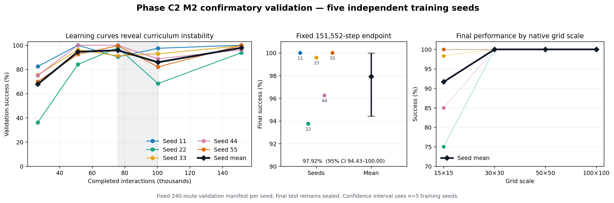
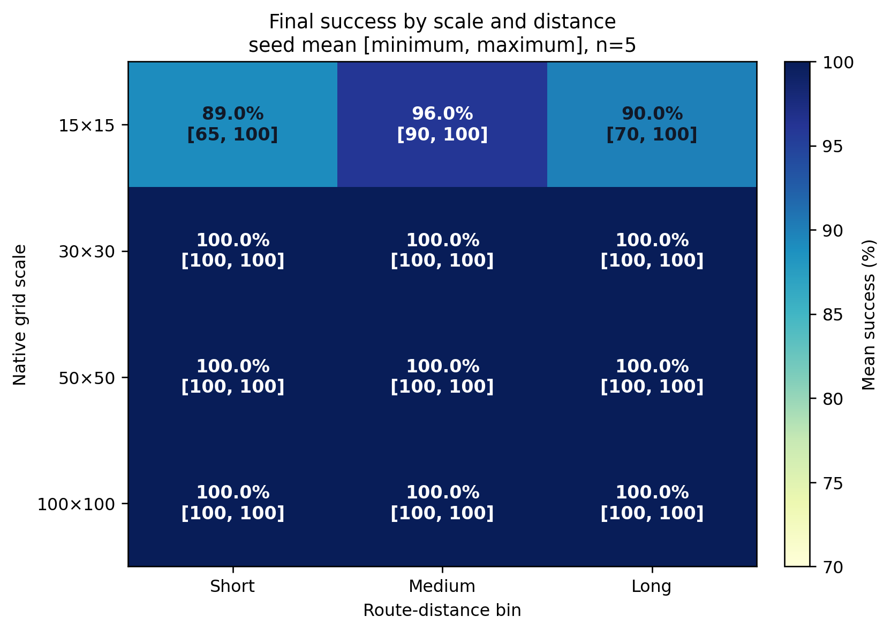

# Phase C2 M2 Confirmatory Result

**Evidence cutoff:** 2026-08-08  
**Classification:** confirmatory validation, five independent training seeds  
**Method status:** frozen M2 scalar policy at a fixed training endpoint  
**Final-test status:** sealed and not accessed

## Executive result

Corrected empty-map multiscale competence is confirmed for M2. Five independently
trained policies achieved a mean validation success rate of **97.92%** at the
preregistered 151,552-interaction endpoint (sample SD **2.81 percentage points**;
seed values 100.00%, 93.75%, 99.58%, 96.25%, and 100.00%). The conventional
two-sided seed-level t interval is 94.43% to 101.41%; the upper endpoint exceeds
the feasible probability range because the interval is symmetric and the sample
is small. The corresponding bounded presentation is 94.43% to 100.00%.

Across the 1,200 route evaluations there were 1,175 successes, 25 timeouts, zero
collisions, and zero invalid actions. The 1,200 route outcomes are descriptive;
they are not substituted for the five independent training seeds when reporting
uncertainty.



## Frozen protocol

The method and endpoint were declared before these confirmation runs in
`docs/phase_c2_v13_confirmatory_protocol.md`:

- model: M2 scalar-only Maskable PPO, approximately 9,545 trainable parameters;
- development seed 42 excluded from confirmation;
- confirmatory training seeds: 11, 22, 33, 44, and 55;
- 150,000 requested interactions, producing the first complete-rollout boundary
  at 151,552 interactions;
- no per-seed checkpoint selection;
- the same fixed 240-route validation manifest for every seed; and
- no final-test access.

The run was local and sequential to avoid contention. The queue was resumable and
wrote complete checkpoint bundles after every evaluation boundary.

## Primary endpoint

| Training seed | Successes | Success rate | Timeouts | Collisions | Invalid actions |
|---:|---:|---:|---:|---:|---:|
| 11 | 240/240 | 100.00% | 0 | 0 | 0 |
| 22 | 225/240 | 93.75% | 15 | 0 | 0 |
| 33 | 239/240 | 99.58% | 1 | 0 | 0 |
| 44 | 231/240 | 96.25% | 9 | 0 | 0 |
| 55 | 240/240 | 100.00% | 0 | 0 | 0 |
| **Seed mean** | — | **97.92%** | — | — | — |

The mean successful-route path-cost ratio was 1.178 across training seeds
(sample SD 0.029; seed-level 95% t interval 1.141 to 1.214). Thus successful
routes were approximately 17.8% more costly than the octile-distance reference
on average. Mean CPU policy-inference latency was 0.836 ms per decision across
seeds (sample SD 0.020 ms). Latency is hardware- and runtime-specific and should
not be interpreted as a universal deployment measurement.

## Scale and distance

The corrected result does not reproduce the old apparent collapse at large grid
sizes. Instead, all observed final failures were concentrated at the smallest
scale.

| Stratum | Seed-mean success | Seed range |
|---|---:|---:|
| 15×15 | 91.67% | 75.00%–100.00% |
| 30×30 | 100.00% | 100.00%–100.00% |
| 50×50 | 100.00% | 100.00%–100.00% |
| 100×100 | 100.00% | 100.00%–100.00% |
| Short distance | 97.25% | 91.25%–100.00% |
| Medium distance | 99.00% | 97.50%–100.00% |
| Long distance | 97.50% | 92.50%–100.00% |



This is evidence about **empty maps**, not obstacle-rich or dynamic routing. In
this setting the relative goal vector is sufficient to express the shortest-step
direction, so M2's lack of a spatial map is not a disadvantage. The result does
not imply that a scalar-only policy will remain sufficient once obstacles make
local geometry and free-space structure decision-relevant.

## Learning dynamics and the curriculum transition

The final endpoint is strong, but training is not monotonic.

| Completed interactions | Seed-mean success | Sample SD | Seed range |
|---:|---:|---:|---:|
| 26,624 | 67.83% | 18.21 pp | 36.25%–82.50% |
| 51,200 | 94.58% | 6.60 pp | 84.17%–100.00% |
| 75,776 | 95.83% | 4.64 pp | 90.42%–100.00% |
| 100,352 | 85.92% | 11.35 pp | 68.33%–97.50% |
| 151,552 | 97.92% | 2.81 pp | 93.75%–100.00% |

The 75,776-to-100,352 transition coincides with adding 100×100 tasks to the
curriculum. Four seeds declined and one improved. The mean change was -9.92
percentage points, but the seed-level 95% t interval was wide (-28.22 to +8.39
points). This is a transparent signal of policy drift or interference, not proof
of a deterministic curriculum effect. The recovery by the fixed final endpoint
shows that the decline was not permanent in these runs.

The correct paper claim is therefore not “training converges smoothly.” It is
that the frozen budget produced high final empty-map competence despite marked
intermediate non-monotonicity. This motivates stability diagnostics in later
phases and argues against choosing a different best checkpoint independently for
each seed.

## Failure analysis

Every one of the 25 final failures was labelled a two-cell-oscillation timeout.
There were no collisions and no illegal actions. All failures occurred on 15×15
routes:

- seed 22: 15 failures;
- seed 33: 1 failure;
- seed 44: 9 failures; and
- seeds 11 and 55: no failures.

This pattern narrows the remaining C2 weakness. It is not a large-scale reachability
failure; it is a policy-cycle problem on a subset of small-grid routes. Previous
action is already part of M2's observation, but it does not eliminate every
two-cell loop. A short cycle-memory feature, recurrent state, action-history
penalty, or inference-time loop breaker could address the mechanism. None should
be retrofitted into this confirmatory result. Any such change is a new method and
requires its own development and confirmation protocol.

## Integrity and provenance

The analysis script independently verified all five runs before producing the
tables and figures:

- queue status is complete and contains exactly seeds 11/22/33/44/55;
- every seed ends at the same complete-rollout boundary, 151,552;
- all 25 checkpoint evaluations use action masking, the authoritative `crashed`
  collision field, zero invalid actions, and exactly 240 unique routes;
- the validation manifest hash and final route order are identical across seeds;
- the ten core training/evaluation source hashes are identical across seeds;
- every checkpoint, model, RNG state, generator state, provenance record, and
  status record is present in the expected archives;
- all ZIP integrity checks pass;
- raw and complete archives are byte-identical within each seed; and
- no archive accidentally contains another checkpoint bundle, raw-artifact
  archive, or complete archive.

Seed 11 was produced by v13 commit
`e16787c68579a854fa19ca7e939654763bb7eae0`; seeds 22–55 were produced by v15
commit `2e7c1758d43eb576de8644880b61aceaae4ad57a`. The difference is confined to
queue orchestration. All ten core training/evaluation hashes match exactly, which
is why seed 11 is retained as protocol-equivalent rather than rerun.

Exact per-seed artifact hashes are recorded in
`evaluation/results/phase_c2_v15_m2_confirmatory_summary.json` and the compact
`evaluation/results/phase_c2_v15_m2_confirmatory_seed_table.csv`.

## Scientific decision

C2 has now answered its intended competence question: after repairing the native
grid-size bug and using an adequate learning signal, a compact scalar policy can
learn empty-map navigation across 15×15 to 100×100 without the old large-scale
collapse. This establishes a sound baseline but does not yet answer the project's
central static- and dynamic-routing question.

The next phase should therefore be C3 rather than further tuning C2 to erase the
remaining 2.08% validation failures. C3 must be treated as a representation and
safety transition:

1. redesign and test collision-aware reward semantics before obstacle training;
2. construct obstacle-aware oracle and reachability gates;
3. reintroduce spatial information (M1 or a better justified spatial encoder),
   while retaining M2 as a negative/control representation;
4. freeze C3 development and confirmatory splits before large training; and
5. keep the final test sealed until the full methodology is frozen.

The two-cell-loop evidence should be carried forward as a prespecified diagnostic.
If loops remain material in obstacle environments, a controlled anti-oscillation
ablation is justified. The evidence does not justify silently changing the
confirmed C2 policy or presenting C2 as proof of dynamic-routing superiority.

## Reproduction

From the repository root, regenerate the integrity report, table, and figures with:

```powershell
python scripts\analyze_phase_c2_confirmatory.py `
  "D:\UAV Dynamic Routing\phase-c2-v13-M2-confirmatory" `
  evaluation\results
```

Then run the reporting and queue-contract tests:

```powershell
python -m pytest -q `
  tests\test_phase_c2_confirmatory_reporting.py `
  tests\test_phase_c2_confirmatory.py `
  tests\test_phase_c2_reporting.py
```

The final-test set is not required and must not be opened by either command.
